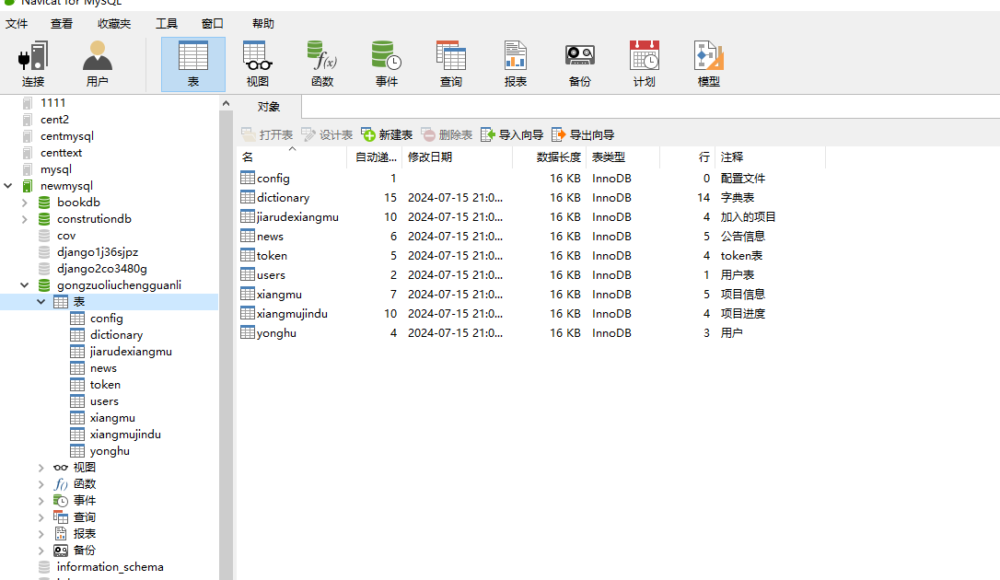
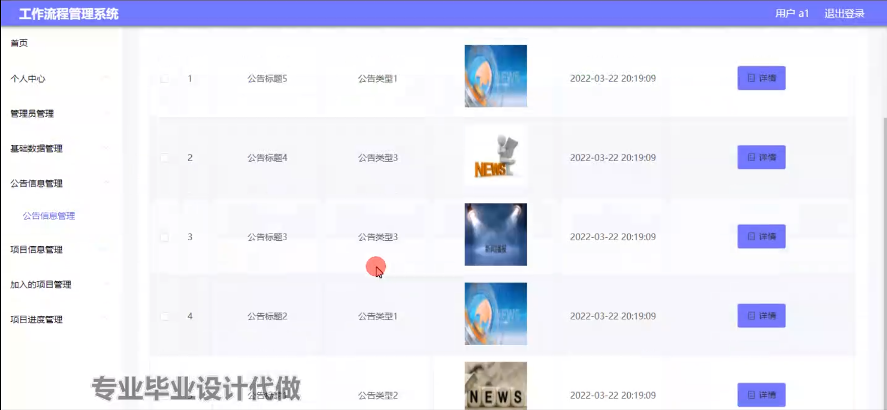

# 基于springboot框架的工作流程管理系统

<h4 style='color:red'>联系不到我，就看我的主页 </h4> 
 
#### 介绍

在当今竞争激烈的商业环境中，企业的业务流程日益复杂，对工作效率和协同性提出了更高的要求。传统的工作管理方式往往存在信息不透明、流程混乱、沟通不畅等问题，严重影响了企业的发展和竞争力。
本基于 Spring Boot 框架的工作流程管理系统旨在为企业提供一个高效、规范、透明的工作流程管理解决方案，帮助企业优化业务流程，提高工作效率，降低管理成本，提升企业的核心竞争力。

#### 技术栈

后端技术栈：Springboot+Mysql+Maven

前端技术栈：Vue+Html+Css+Javascript+ElementUI

开发工具：Idea+Vscode+Navicate

#### 系统功能介绍

（一）管理员角色  
个人中心：管理员可以在个人中心查看和修改自己的个人信息，如姓名、联系方式、密码等。  
管理员管理：  
新增管理员账号，并设置相应的权限和职责。  
对现有管理员进行信息修改、权限调整和账号禁用/启用等操作。  
基础数据管理：  
对员工信息进行管理，包括员工的基本资料、所属部门、职位等。  
维护企业的组织架构信息，如部门设置、层级关系等。  
管理企业的各类资源信息，如设备、场地等。  
公告信息管理：  
发布企业内部的通知、公告，如会议通知、政策变动等。  
编辑和删除已发布的公告，确保信息的准确性和及时性。  
项目信息管理：  
创建新的项目，包括项目名称、项目描述、起止时间、负责人等。  
查看项目的详细信息，对项目进行修改、删除和暂停/启动等操作。  
加入的项目管理：  
查看管理员所加入的项目列表。  
对参与的项目进行任务分配、资源调配等管理操作。  
项目进度管理：  
跟踪项目的进度，包括已完成的任务、正在进行的任务和未开始的任务。  
对项目进度进行评估和调整，确保项目按时完成。  
用户管理：  
对系统用户进行注册审批，审核用户提交的注册信息。  
查看用户的登录记录和操作日志，监控用户的系统使用情况。  

（二）用户角色  
个人中心：用户可以在个人中心查看和修改自己的个人信息。  
管理员管理：用户可以查看管理员的相关信息，但无修改和管理权限。  
基础数据管理：  
查看企业的组织架构和人员信息，方便工作中的沟通和协作。  
了解企业的资源分布情况，便于申请和使用相关资源。  
公告信息管理：及时获取企业发布的公告信息，了解企业的最新动态和重要通知。  
项目信息管理：  
查看自己参与的项目信息，了解项目的目标、任务和要求。  
向项目负责人反馈项目执行过程中的问题和建议。  
加入的项目管理：  
申请加入感兴趣的项目，等待管理员审批。  
对已加入的项目进行任务执行和进度汇报。  
项目进度管理：  
实时了解自己负责的任务进度，确保按时完成。  
向管理员反馈项目进度中的困难和障碍。  

#### 系统作用

提高工作效率  
规范工作流程，减少不必要的环节和重复劳动，使工作更加高效有序。  

增强协同合作  
促进团队成员之间的信息共享和沟通交流，提高协同工作的效果。  

提升管理水平  
为管理者提供全面、准确的工作数据和进度信息，便于进行科学决策和有效管理。  

保障项目质量  
对项目进行全程监控和管理，及时发现和解决问题，确保项目按时、按质完成。

#### 系统功能截图

代码结构

数据库表

登录

基础数据管理

项目信息管理

加入的项目管理

项目进度管理

用户管理

用户端个人信息

公告信息管理

#### 总结

基于 Spring Boot 框架的工作流程管理系统为企业的工作流程管理带来了显著的改进。然而，该系统仍存在一些有待完善的地方，例如对于复杂业务流程的支持还不够灵活，系统的界面友好性和操作便捷性还有提升空间，在与其他企业系统的集成方面可能存在一定的难度。未来，我们将持续优化系统功能，提升用户体验，加强系统的兼容性和扩展性，以更好地满足企业不断发展的工作流程管理需求。

#### 使用说明

创建数据库，执行数据库脚本 修改jdbc数据库连接参数 下载安装maven依赖jar 启动idea中的springboot项目

后台登录页面
http://localhost:8080/gongzuoliuchengguanli/admin/dist/index.html

管理员				账户:admin 		密码：admin

用户				账户:a1 		密码：123456